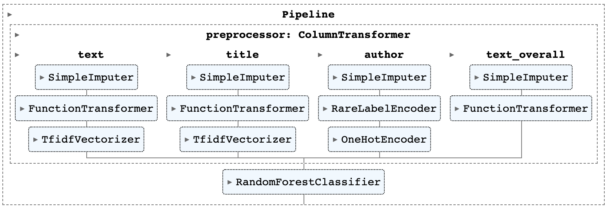

# MVML Take Home Assignment

## Create and activate env:
```shell
conda env create --file conda.yml
conda activate mvml
```

## Model training
`train.py` builds and fits a pipeline for data preprocessing and modeling with basic params tuning and cross validation

```shell
python train.py --train_data_path 'data/train.csv' --model_output_path 'models/model.pkl' --test_data_path 'data/test.csv'  --test_labels_path 'data/labels.csv'
```



## To run app to interact with a model
```shell
gradio app.py
```

## Next steps
1. Perform deeper EDA steps for better data understanding. Especially for different languages
2. Add feature selection step
3. Improve text data preprocessing, add other derivative features
4. Include more tuning params
5. Test another modeling algos
6. Enrich the dataset using 3rd party data sources
7. Test approach with finetuning of SOTA DL models
